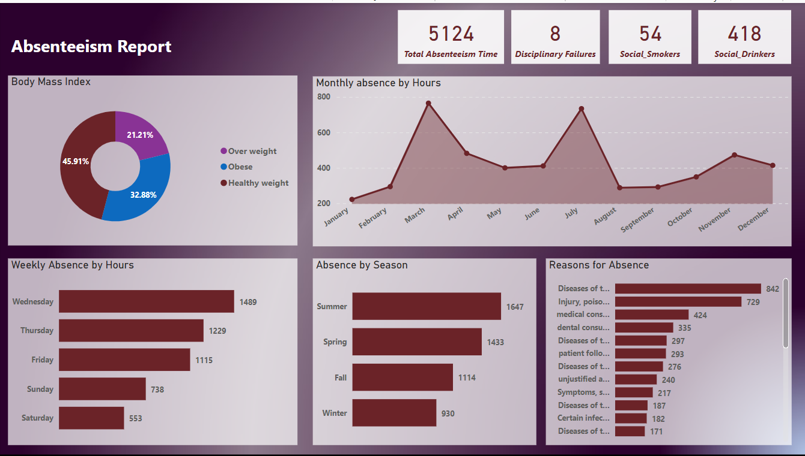

## Absenteeism Report
### Table of Content
- [Project Overview](#project-overview)
- [Data Sources](#data-sources)
- [Tools](#tools)
- [Data Cleaning](#data-cleaning)
- [Exploratory Data Analysis](#exploratory-data-analysis)
- [Data Analysis](#data-analysis)
- [Result](#result)
- [Recommendations](#recommendations)
- [Limitations](#limitations)
- [Reference](#reference)

### Project Overview
The aim of this project is to present Human Resources team with an analysis to help them understand absenteeism at work. they would like to know the reasons, rate and trend of employees absenteeism at work. The HR team would also like the get a list of the healthiest employees in order to give them a bonus, which total budget amount is $1000, they also would want to give an annual compensation to workers who don't smoke and the budget amount is $983,221.

### Data sources
The dataset used for this project is an open dataset made available to public on Kaggle.

### Tools
- SQL server - I used sql for data cleaning 
- PowerBi - used to transform data and create Dashboard

### Data Cleaning
1. remove irrelevant columns
2. convert month number to month name
3. convert day number to day name
4. create calculated columns

### Exploratory Data Analysis
- Provide a list of healthy individuals with low absenteeism for a healthy bonus program
- -calculate a wage increase or annual compensation for non-smokers
- Create a dashboard for the HR to understand absenteeism at work

### Data Analysis
This contain the some interesting querries that i used to transform and retrieve neccessary information from the dataset

```sql
--join all the table to get one usable table

SELECT *
FROM Absenteeism A
LEFT JOIN compensation C
ON A.ID = C.ID
LEFT JOIN Reasons R
ON A.Reason_for_absence = R.Number

--Finding the healthiest employee with low absenteeism for bonus

SELECT * 
FROM Absenteeism
WHERE Social_drinker =0 AND Social_smoker =0 and Body_mass_index <25
AND Absenteeism_time_in_hours < (SELECT AVG(Absenteeism_time_in_hours) FROM absenteeism)

-- compensation rate for non smokers/ Budget $983,221. 
-- total hours worked by non-smokers employees  //  8hrs daily* 5day * 52weeks * 686 employees non_smokers  =1,426,880.
--Percentage of increase //  budget (983,221) /total hors (1,426,880) = 0.68

--number of non-smokers employees
SELECT COUNT(*)
FROM Absenteeism
WHERE Social_smoker =0		


-- Optimizing the joined table
SELECT 
A.ID,
R.Reason,
A.Month_of_absence,
DATENAME(MONTH, DATEADD(MONTH,[Month_of_absence] , -1)) AS Month_name,
CASE 
	WHEN month_of_absence in (12,1,2) THEN 'Winter'
	WHEN month_of_absence in (3,4,5) THEN 'Summer'
	WHEN month_of_absence in (6,7,8) THEN 'Spring'
	WHEN month_of_absence in (9,10,11) THEN 'Fall'
	ELSE 'Unknown'
	END AS 'Season',
A.Day_of_the_week,
DATENAME(WEEKDAY,[Day_of_the_week]) Week_day,
A.transportation_expense,
A.service_time,
A.age,
A.Work_load_Average_day,
A.Hit_target,
A.disciplinary_failure,
A.Son,
A.Social_drinker,
A.Social_smoker,
A.Pet,
A.Weight,
A.Absenteeism_time_in_hours,
A.Body_mass_index,
CASE
	WHEN a.Body_mass_index < 18 THEN 'Under weight'
	WHEN a.Body_mass_index BETWEEN 19 AND 25 THEN 'Healthy weight'
	WHEN a.Body_mass_index BETWEEN 25 AND 30 THEN 'Over weight'
	WHEN a.Body_mass_index >=31 THEN 'Obese'
	ELSE 'Unknown'
	END AS 'BMI'
FROM Absenteeism A
LEFT JOIN compensation C
ON A.ID = C.ID
LEFT JOIN Reasons R
ON A.Reason_for_absence = R.Number
ORDER BY 3,5

--Average hour of absenteeism
SELECT AVG(absenteeism_time_in_hours)
FROM Absenteeism

--Percentage of social drinkers
SELECT [Social_drinker], 
COUNT([Social_drinker])*100/SUM(COUNT(*)) over() Percentage_of_drinkers
FROM Absenteeism
GROUP BY [Social_drinker]

-- percentage of social smokers
SELECT [Social_smoker],
COUNT(*)*100/(SELECT COUNT([Social_smoker]) FROM Absenteeism) Percentage_of_smokers
FROM Absenteeism
GROUP BY [Social_smoker]

--percentage of disciplinary failures
SELECT [Disciplinary_failure],
COUNT(*)*100/(SELECT COUNT([Disciplinary_failure]) FROM Absenteeism)
FROM Absenteeism
GROUP BY [Disciplinary_failure];
```
### Visual Report



### Result
the summary of the analysis are as follows;
1. There is a total of 5124 hours of employee absences in that specific year.
2. the company has 54 employees who are social smokers and 418 employees who are social drinkers. 
3. The month of January has the lowest rate of 222hrs of employees absence, and a slight increase to 294hrs in the month of February.
4. The month of March has the highest absenteeism rate (765 hours), followed by a decline in April and May and another significant increase in June to 734hrs.
5. By seasons, summer appears to have the most employee absence hours (1647 hours), while winter appears to have the lowest employee absence hours (930 hours).
6. 729hours in the total of 5124hours was as a result of physical injuries, poisoning and injuries caused by external factors, which is the top 2 reasons of employees absence.

### Recommendations
- Stakeholders and management should provide more safety equipment for the employees and conduct a thorough sensitization campaign on how to use protective equipment while on duty to reduce the level of injuries at work. As one of the main causes of employee absences from work are injuries, poisoning and certain consequences of external causes, which has cost the company valuable hours of productivity.
  

### limitations
- The dataset does not have any information on the year
- There is no information on the nature of the company or business operations this dataset was created from, therefore, limiting understanding and usage of the dataset to create more insigh and provide recommendation.

### Reference


